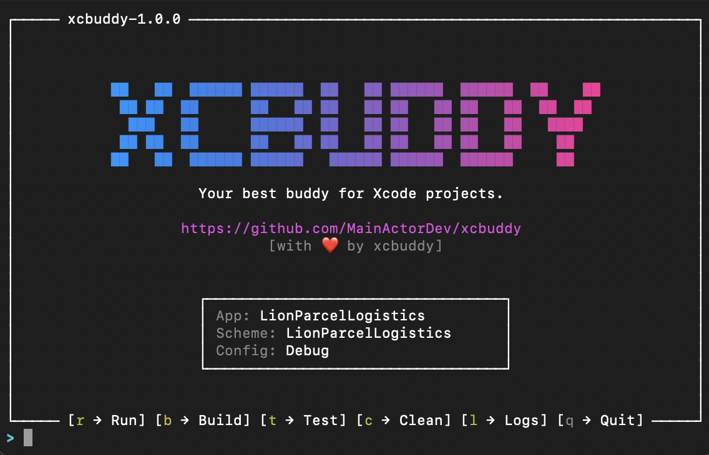

<p align="center">
  
</p>

# xcbuddy 🚀

**The missing CLI for Xcode. Build, test, and manage iOS simulators with zero pain.**

`xcbuddy` is a lightweight, high-performance Swift CLI wrapper for `xcodebuild`, `xcrun simctl`, and other iOS development tools. It eliminates the verbosity of raw Xcode commands through intelligent auto-detection, fuzzy matching, and sensible defaults.

## ✨ Key Features

- **Auto-Detection**: Automatically finds `.xcworkspace`, `.xcodeproj`, or `Package.swift`.
- **Fuzzy Simulator Matching**: Use `xcbuddy run -d "16 Pro"` instead of long destination strings.
- **Project Insights**: Quickly view targets and configurations with `xcbuddy info`.
- **Fast Xcode Access**: Open your project or DerivedData instantly with `xcbuddy open`.
- **Built-in Tooling**: Lint and format code with integrated wrappers.
- **Smart Launching**: Automatically boots simulators and opens the Simulator app before launching your app.
- **Clean with Power**: `xcbuddy clean --deep` wipes the specific DerivedData folder for your project.
- **Real-time Logs**: `xcbuddy logs` streams simulator console output directly to your terminal.
- **Beautified Output**: Integrated support for `xcbeautify` for readable build logs.

## 🛠 Installation

### From Source
```bash
git clone https://github.com/MainActorDev/xcbuddy.git
cd xcbuddy
chmod +x install.sh
./install.sh
```

*The script will automatically compile xcbuddy, move it to `~/.local/bin`, and verify your `$PATH`.*

## 🤖 Agentic Coding

If you are using AI coding assistants, `xcbuddy` includes a `SKILL.md` file designed to provide agents with the context they need to use this tool effectively. Point your agent to the `SKILL.md` file in the root of this repository to ensure it uses the best commands and follows the recommended development flow.

## 🚀 Usage

### Interactive Dashboard ✨ (Recommended)
`xcbuddy` features a beautiful, boxed terminal UI dashboard for rapid development. Run the dashboard and use simple hotkeys to build, test, run, and stream logs without verbose console output!
```bash
xcbuddy i
```
*Keyboard Shortcuts:* `r` (Run), `b` (Build), `t` (Test), `s` (Select Simulator), `c` (Clean), `l` (Logs), `q` (Quit).

### Standalone Commands

#### Build & Run
```bash
# Build the project in the current directory
xcbuddy build

# Build and run on a specific simulator (fuzzy matched)
xcbuddy run -d "16 Pro"

# Build and run on the currently booted simulator
xcbuddy run
```

### Testing
```bash
# Run all tests
xcbuddy test

# Run a specific test class
xcbuddy test --only "MyTests/LoginTests"

# Run tests and generate/open an HTML coverage report
xcbuddy test --coverage
```

### Simulator Management
```bash
# List available simulators in a clean format
xcbuddy sim list

# Boot a simulator by name
xcbuddy sim boot "iPhone 15"
```

### Logging
```bash
# Stream all logs from the booted simulator
xcbuddy logs

# Stream logs filtered by process name
xcbuddy logs -p "MyAwesomeApp"
```

### Project Management
```bash
# Open the project in Xcode
xcbuddy open

# Open the project's DerivedData folder in Finder
xcbuddy open --derived-data

# Clean the project
xcbuddy clean

# Deep clean (delete specific DerivedData folder)
xcbuddy clean --deep

# Create a new Swift project
xcbuddy create MyNewProject --type executable
```

### Insights & Tooling
```bash
# Print project targets, schemes, and configurations
xcbuddy info

# Swift Package Manager shortcuts
xcbuddy spm resolve
xcbuddy spm update

# Run swiftlint or swiftformat in the current directory
xcbuddy lint
xcbuddy format
```

## 📄 License
MIT License. See [LICENSE](LICENSE) for details.
